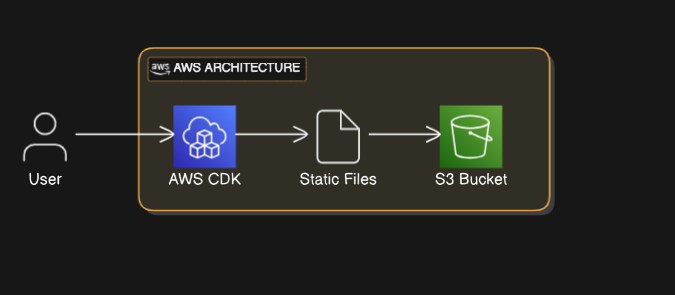
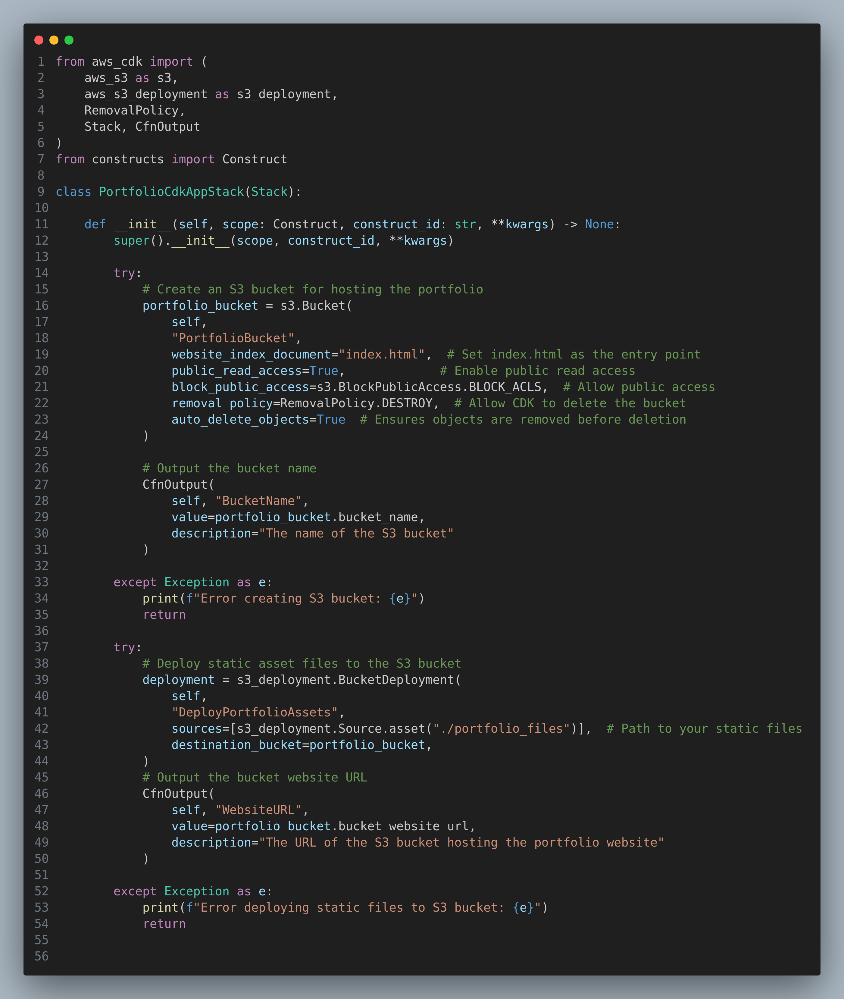

Here’s a polished and enhanced version of your README with the AWS architecture diagram (`cdk.png`) embedded:

---

# Deploy Portfolio Static Files to S3 with AWS CDK

This project uses **AWS CDK** to create an S3 bucket and upload static files for hosting a portfolio website. The architecture is simple, cost-effective, and scalable.

---

## Prerequisites

Before you begin, ensure the following are installed and configured:

- **Node.js** (LTS version or later)
- **Python 3.7+** with `pip`
- **AWS CLI** configured with credentials
- **AWS CDK** installed globally:
  ```bash
  npm install -g aws-cdk
  ```
- Virtual environment setup for Python:
  ```bash
  python3 -m venv .venv
  source .venv/bin/activate  # On Windows: .venv\Scripts\activate.bat
  pip install -r requirements.txt
  ```

---

## Project Structure

```
.
├── app.py
├── assets
├── cdk.json
├── cdk.out
├── portfolio_cdk_app
├── portfolio_files 
│   └── (Your static files here, e.g., index.html, css, js, images)
├── README.md
├── requirements-dev.txt
├── requirements.txt
├── source.bat
└── tests
```

---

## AWS Architecture

Below is the architecture diagram for this project:



---

## Steps to Deploy

### 1. Clone the Project

Clone the repository and navigate to the project directory.

```bash
git clone <repo-url>
cd <project-name>
```

### 2. Add Your Static Files

Place all portfolio static files (e.g., `index.html`, `css`, `images`, etc.) into the `assets` directory.

### 3. Synthesize the CDK Stack

Run the following command to generate the CloudFormation template:

```bash
cdk synth
```

### 4. Deploy the S3 Bucket and Upload Files

Deploy the stack to your AWS account and region:

```bash
cdk deploy
```

This will create:
- An S3 bucket for hosting the portfolio.
- Static files from the `assets` folder automatically uploaded to the S3 bucket.

### 5. Access Your Portfolio

Once the deployment is complete:
1. The S3 bucket's **Website URL** will be displayed in the terminal.
2. Open the URL in your browser to view the portfolio.

---

## Useful Commands

| Command                | Description                                      |
|------------------------|--------------------------------------------------|
| `cdk synth`            | Generates the CloudFormation template.           |
| `cdk deploy`           | Deploys the stack to your AWS account.           |
| `cdk destroy`          | Destroys the deployed stack.                     |
| `cdk diff`             | Compares the deployed stack with local changes.  |
| `cdk ls`               | Lists all stacks in the project.                 |

---

## Example Code

The core implementation is in the `app.py` file. Below is an example of the S3 bucket and file upload code:



## Cleanup

To delete the resources created by this stack:

```bash
cdk destroy
```

This will remove the S3 bucket and all its contents.

---

### Notes:
- Ensure your static files include an `index.html` for proper website hosting.
- Use `.gitignore` to exclude sensitive or large files from version control.

