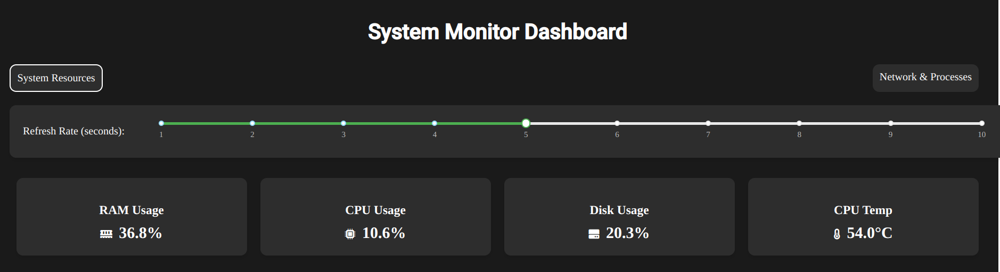
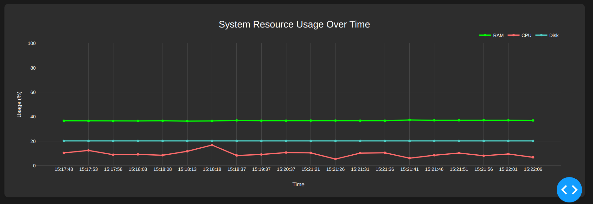
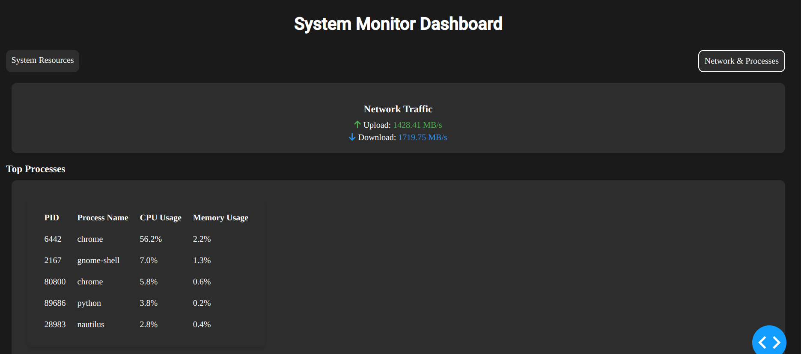

# System Monitoring Dashboard

A real-time system monitoring dashboard built with **Dash** and **Plotly**. This application provides live updates on CPU, RAM, Disk usage, network traffic, and CPU temperature. It also displays the top processes consuming system resources.



---

## Features

- **Real-time Monitoring**:
  - CPU Usage
  - RAM Usage
  - Disk Usage
  - Network Traffic (Upload/Download)
  - CPU Temperature (if available)

- **Interactive Dashboard**:
  - Combined or separate graphs for CPU, RAM, and Disk usage.
  - Alert cards with warning and critical thresholds.
  - Top processes by CPU usage.

- **Customizable Refresh Rate**:
  - Adjust the refresh interval (1-10 seconds) using a slider.

- **Two Modes**:
  - **Single Graph Mode**: Displays all metrics in one combined graph.
  - **Multiple Graphs Mode**: Displays separate graphs for CPU, RAM, and Disk usage.

---

## Prerequisites

Before running the project, ensure you have the following installed:

- **Python 3.7+**
- **pip** (Python package manager)
- **Docker** (optional, for containerized deployment)

---

## Installation

1. **Clone the Repository**:
   ```bash
   git clone https://github.com/your-username/system-monitor-dashboard.git
   cd system-monitor-dashboard
   ```

2. **Set Up a Virtual Environment** (optional but recommended):
   ```bash
   python3 -m venv .venv
   source .venv/bin/activate  # On Windows: .venv\Scripts\activate.bat
   ```

3. **Install Dependencies**:
   ```bash
   pip install -r requirements.txt
   ```

---

## Running the Application

### Locally

1. Run the application in **Single Graph Mode**:
   ```bash
   python app.py one
   ```

2. Run the application in **Multiple Graphs Mode**:
   ```bash
   python app.py multiple
   ```

3. Open your browser and navigate to:
   ```
   http://localhost:8050
   ```

### Using Docker

1. Build the Docker image:
   ```bash
   docker build -t system-monitor-dashboard .
   ```

2. Run the Docker container:
   ```bash
   docker run -p 8050:8050 system-monitor-dashboard
   ```

3. Access the dashboard at:
   ```
   http://localhost:8050
   ```

---

## Project Structure

```
.
├── app.py                  # Main application code
├── assets/                 # Static assets (e.g., images, styles)
├── requirements.txt        # Python dependencies
├── Dockerfile              # Docker configuration
├── docker-compose.yml      # Docker Compose configuration (optional)
└── README.md               # Project documentation
```

---

## Customization

- **Thresholds**: Modify the `THRESHOLDS` dictionary in `app.py` to adjust warning and critical levels for CPU, RAM, and Disk usage.
- **Colors**: Customize the `COLORS` dictionary in `app.py` to change the dashboard's color scheme.
- **Refresh Rate**: Use the slider in the dashboard to adjust the refresh interval (1-10 seconds).

---

## Screenshots

### System Graph Resources
 <!-- Add a screenshot if available -->

### Network and Process
 <!-- Add a screenshot if available -->

---

## License

This project is licensed under the MIT License. See the [LICENSE](LICENSE) file for details.

---

## Contributing

Contributions are welcome! Please open an issue or submit a pull request for any improvements or bug fixes.

---

## Acknowledgments

- Built with [Dash](https://dash.plotly.com/) and [Plotly](https://plotly.com/).
- Uses [psutil](https://psutil.readthedocs.io/) for system monitoring.

